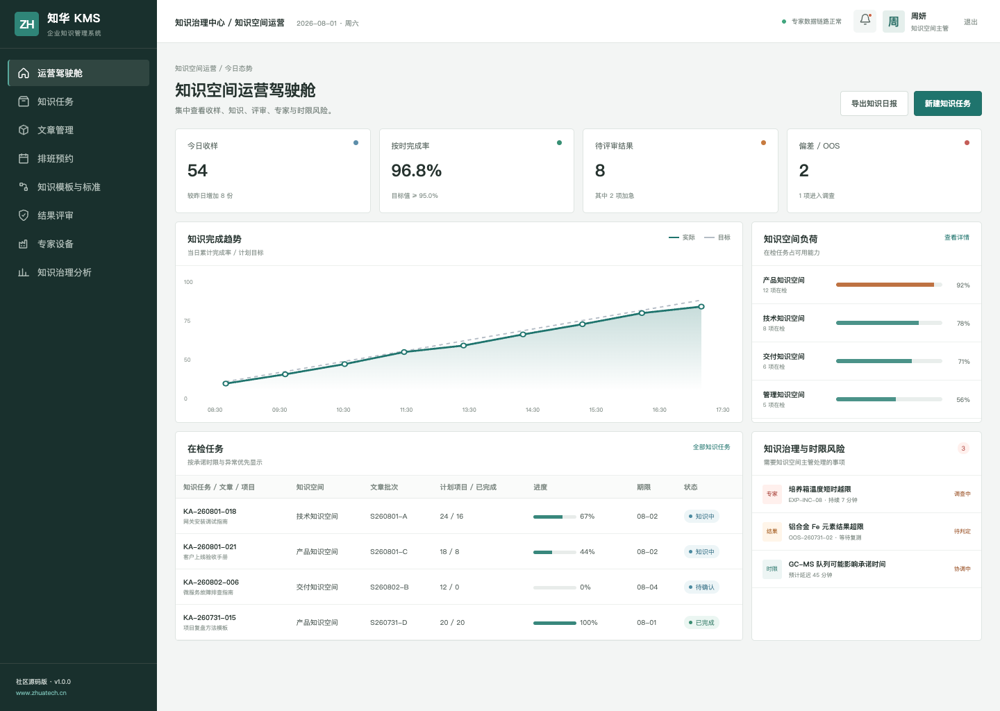
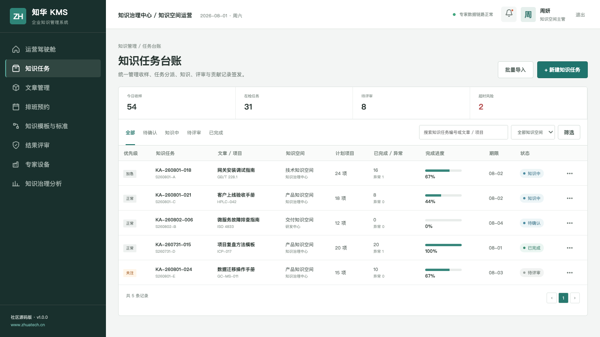
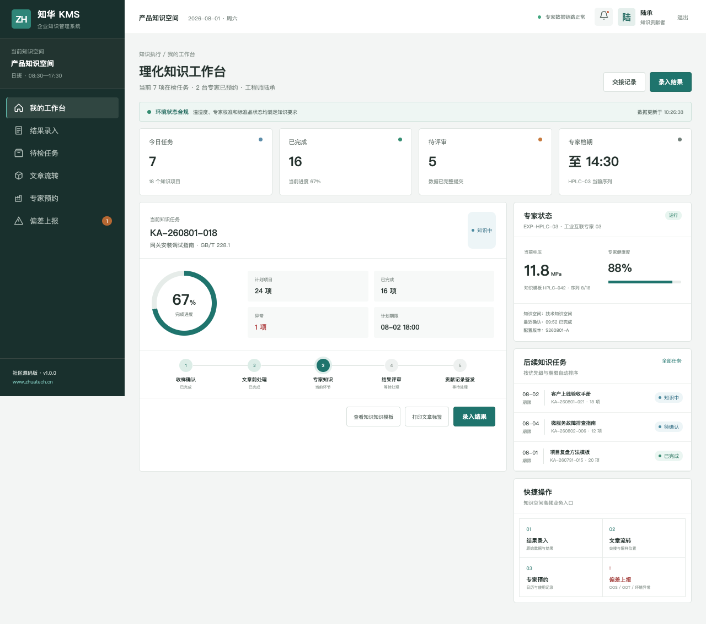

# ZhuaTech KMS Community Edition

## 企业知识管理系统

[](backend/pom.xml) [](frontend/package.json) [](compose.yaml) [](LICENSE)

沉淀可检索、可评审、可复用的组织知识，让经验真正进入业务现场。 本仓库是[知华科技](https://www.zhuatech.cn/)（上海如静知华信息科技有限公司）面向技术学习与交流发布的社区源码工程。

## 一眼了解业务

- **流程**：知识提报 → 内容编写 → 专家评审 → 发布检索 → 使用反馈 → 版本迭代
- **用户**：知识贡献者、知识经理、领域专家、系统管理员
- **终端**：后台管理端 + 响应式 H5 岗位端
- **特点**：可运行 API、MySQL 迁移、JWT 权限、领域化演示数据

1. 知识空间、分类标签与文章版本
2. 专家评审、贡献任务与发布流程
3. 全文检索、热度反馈和知识健康度

## 产品实景

### 知识运营驾驶舱



### 知识文章与评审台账



### 知识贡献者工作台



## 架构选型

| 部分 | 技术与职责 |
| --- | --- |
| 后端 | Java 21、Spring Boot、Spring Security、JPA、Flyway |
| 前端 | Vue 3、Pinia、Vue Router、Axios、Vite，响应式管理端与 H5 岗位端 |
| 数据 | MySQL 8；H2 集成测试 |
| 交付 | Docker Compose、Nginx、环境变量配置 |

Java 工程包名为 `cn.zhuatech.kms`，数据库名为 `zhuatech_kms`。角色覆盖知识贡献者、知识经理、领域专家、系统管理员。

## 本地启动手册

仅看演示界面：

```bash
cd frontend
npm install
npm run dev:demo
```

打开 `http://localhost:5173`。管理端账号 `planner / Demo@2026`，岗位端账号 `operator / Demo@2026`。

完整启动：

```bash
cp .env.example .env
# 修改数据库密码与 JWT_SECRET
docker compose up --build
```

## 新增：知识新鲜度评估

新增 `POST /api/admin/knowledge-freshness`，使用复核间隔、近 90 天浏览量、帮助率、关联事件和责任人状态计算知识新鲜度，并给出 `HEALTHY`、`PROMOTE`、`REVIEW` 或 `RETIRE` 建议，帮助知识运营人员建立持续治理队列。

## 从演示到生产

仓库中的账号、客户、指标、工单和经营数据均为虚构演示数据。正式落地时应更换默认密码与 JWT 密钥，配置 HTTPS、最小权限、数据库备份、操作审计、脱敏策略，并按照所在行业完成安全与合规评估。

## 个人学习许可与企业授权

本工程仅允许个人、非商业性的学习、研究和技术交流，**不得商用**。企业内部使用、生产部署、SaaS、客户交付、收费培训、咨询实施及品牌替换，均须事先取得上海如静知华信息科技有限公司书面授权。完整条款见 [LICENSE](LICENSE)。

需要深度开发、私有化部署、系统集成或商业授权，请访问[知华科技官网](https://www.zhuatech.cn/)，也可扫码添加微信咨询：

| 微信咨询 1 | 微信咨询 2 |
| --- | --- |
|  |  |

搜索收录建议：KMS 源码、知识管理系统、企业知识库、文档评审、Java KMS、Vue KMS、企业级 KMS、知华科技、上海如静知华信息科技有限公司。

## 知识缺口识别

新增 `POST /api/kms/insights/knowledge-gap`，结合未命中搜索、重复工单、可用专家和相关条目计算主题缺口优先级，输出 `MONITOR`、`ASSIGN_EXPERT` 或 `CREATE_CONTENT`。
